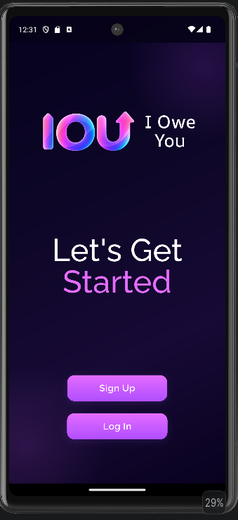
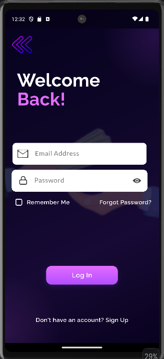
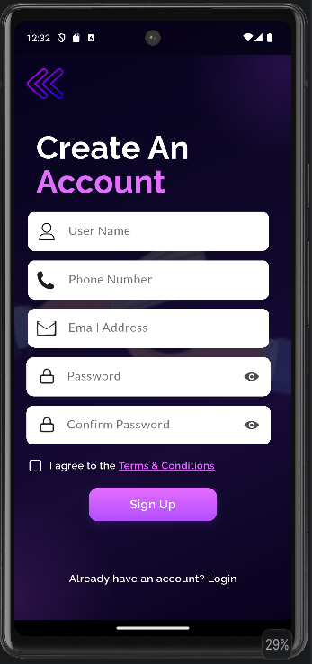
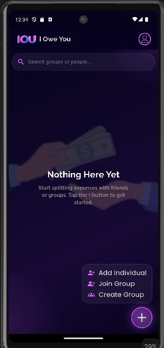
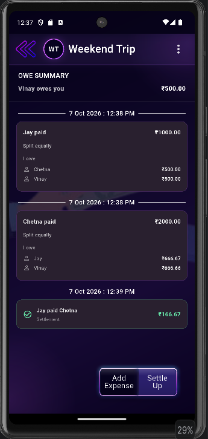
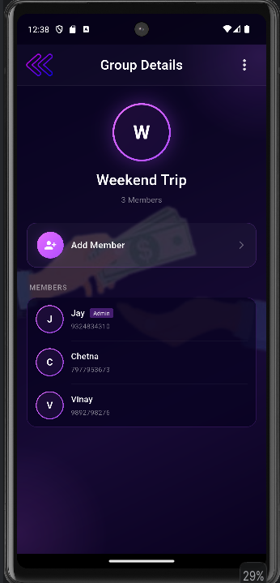
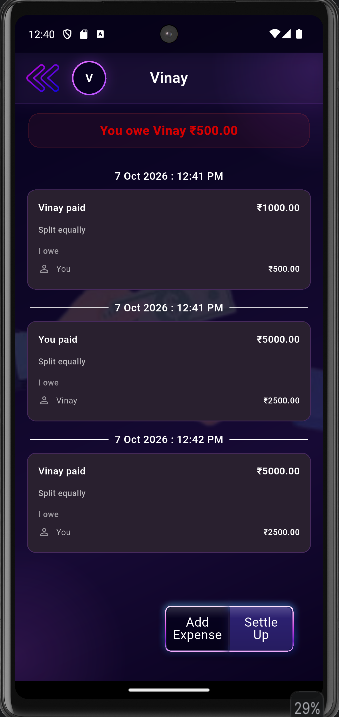
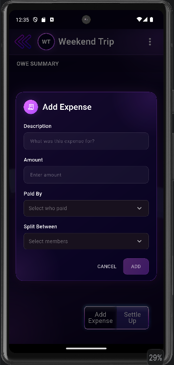
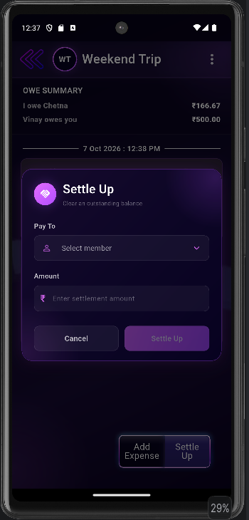

# IOU — I Owe You

### Split. Track. Settle.

A modern Flutter expense-sharing application for splitting bills, tracking shared expenses, managing groups, and keeping track of who owes whom.

**Flutter 3.44** · **Dart 3.12** · **Android** · **Flask** · **MongoDB Atlas**

---

## ✨ Features

- 🔐 User Authentication
- 📱 Firebase OTP Verification
- 👥 Group Expense Management
- 💰 Equal Expense Splitting
- 🎯 Exact / Custom Amount Splitting
- 📊 Percentage-Based Splitting
- 🧾 Itemized Expense Splitting
- 💸 Tax & Tip Support
- 🤝 Individual Expense Tracking
- ⚖️ Balance & Settlement Tracking
- 📇 Device Contact Integration
- 🔎 Group & Contact Search
- 📜 Transaction History
- 🔄 Pull-to-Refresh
- 🎨 Dark Purple Glassmorphism UI
- ✨ Gradient & Animated Components
- 📄 Terms & Conditions

---

## 📱 Screenshots

### Authentication

**Get Started**



**Login**



**Sign Up**



---

### Home & Groups

**Home**



**Groups**



**Group Details**



---

### Expenses

**Individual**



**Add Expense**



**Settle Up**



---

## 🛠 Tech Stack

### Frontend

- **Flutter** — Mobile Application Framework
- **Dart** — Programming Language
- **Provider** — State Management
- **GoRouter** — Navigation
- **Dio** — HTTP Networking
- **Firebase Auth** — OTP Authentication
- **Flutter Secure Storage** — Secure Token Storage
- **Flutter Contacts** — Device Contact Integration
- **Flutter Dotenv** — Environment Configuration

### Backend

- **Flask** — REST API Backend
- **Python** — Backend Programming Language
- **MongoDB Atlas** — Database
- **JWT** — Authentication
- **Render** — Backend Deployment
---

## 📂 Project Structure

```text
IOU_Flutter/
│
├── android/
│
├── assets/
│   ├── icons/
│   ├── images/
│   ├── logos/
│   └── screenshots/
│
├── backend/
│   ├── database/
│   ├── middleware/
│   ├── models/
│   ├── routes/
│   ├── services/
│   ├── tests/
│   ├── utils/
│   ├── app.py
│   ├── config.py
│   └── requirements.txt
│
├── lib/
│   ├── core/
│   ├── features/
│   ├── models/
│   ├── providers/
│   ├── repositories/
│   ├── routes/
│   ├── screens/
│   ├── widgets/
│   └── main.dart
│
├── pubspec.yaml
└── README.md

```
## 🚀 Getting Started

### Prerequisites

Make sure you have the following installed:

- Flutter SDK
- Dart SDK
- Android Studio
- Android SDK
- Physical Android device or Android emulator
- Python 3.x for the Flask backend

### Clone the Repository

```bash
git clone https://github.com/jays1310/IOU_Flutter.git
cd IOU_Flutter

```

### Install Flutter Dependencies

```bash
flutter pub get
```

### Configure Environment Variables

Create a `.env` file in the Flutter project root:

```env
BASE_URL=YOUR_BACKEND_URL
```

For the deployed backend:

```env
BASE_URL=https://iou-flutter-backend.onrender.com
```

> **Important:** Do not commit your `.env` file or expose secrets such as database credentials, API keys, or private configuration values.

### Run the Application

```bash
flutter run
```

---

## 🌐 Backend

IOU uses a **Flask REST API** to communicate between the Flutter application and **MongoDB Atlas**.

The production backend is deployed using **Render**.

### Production Backend

```text
https://iou-flutter-backend.onrender.com
```

### Backend Local Setup

Navigate to the backend directory:

```bash
cd backend
```

Install the required Python packages:

```bash
pip install -r requirements.txt
```

Run the Flask server:

```bash
python app.py
```

For production deployment, the backend can be served using Gunicorn.

---

## 📦 Packages Used

### Flutter

- `provider` — State Management
- `dio` — HTTP Networking
- `google_fonts` — Typography
- `flutter_svg` — SVG Rendering
- `flutter_animate` — Animations
- `intl` — Date & Time Formatting
- `flutter_secure_storage` — Secure Storage
- `flutter_contacts` — Device Contacts
- `uuid` — Unique ID Generation
- `flutter_dotenv` — Environment Configuration
- `go_router` — Navigation
- `toastification` — Toast Notifications
- `firebase_core` — Firebase Integration
- `firebase_auth` — Authentication
- `pinput` — OTP Input
- `flutter_launcher_icons` — Android Launcher Icon Generation

### Backend

- **Flask** — REST API
- **MongoDB Atlas** — Database
- **JWT** — Authentication
- **Gunicorn** — Production Server
- **Render** — Backend Deployment

---

## 🔮 Future Improvements

- 🔔 Push Notifications
- 🔁 Recurring Expenses
- 🏷️ Expense Categories
- 📊 Advanced Expense Analytics
- 📈 Charts & Spending Insights
- 🧾 Receipt / Image Scanning
- 🌍 Multi-Currency Support
- ⚡ Smart Settlement Optimization
- 🤖 Automated Expense Insights
- 🔄 CI/CD Pipeline

---

## 👨‍💻 Developer

**Jay Sheth**

Mobile Application Developer

[](https://github.com/jays1310)

[](https://www.linkedin.com/in/jay-sheth-515579284/)

---

## ⭐ Support

If you find this project useful, consider giving it a ⭐ on GitHub.

Your support is greatly appreciated!

---

**IOU — I Owe You**

*Split. Track. Settle.*